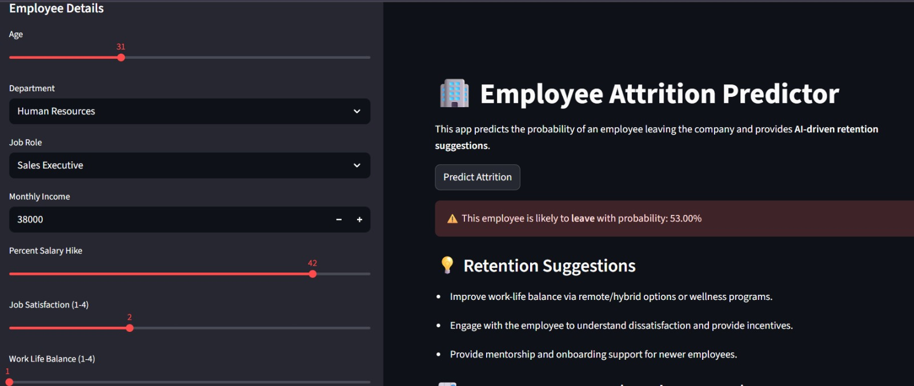
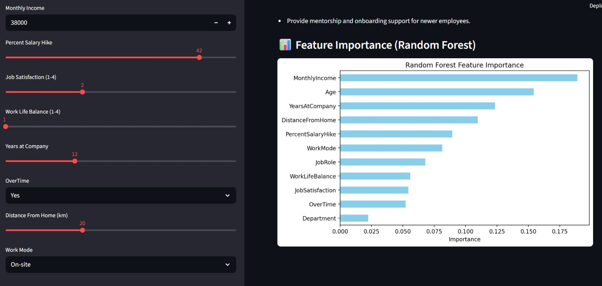

# 🧠 Employee Attrition Predictor  
### Predict Employee Turnover Using Machine Learning  


---

### 🚀 Overview
The **Employee Attrition Predictor** is a machine learning web app built with **Streamlit** that predicts the likelihood of employee attrition based on key HR features like job role, salary, satisfaction, overtime, and more.  
It helps organizations **analyze workforce trends** and take **proactive retention measures**.

---

### 🧩 Key Features
- 🔍 Predicts employee attrition probability in real-time  
- 📊 Visualizes employee demographics and salary insights  
- 🧠 Machine learning backend using Random Forest Classifier  
- 🧹 Modularized code with separate preprocessing and model files  
- 🇮🇳 Tuned dataset to reflect Indian salary structure for realism  

---

### 🧮 Tech Stack
- **Frontend:** Streamlit  
- **Backend:** Python (Scikit-learn, Pandas, NumPy)  
- **Visualization:** Matplotlib, Seaborn  
- **Deployment-ready:** Works locally or via cloud (Streamlit Cloud / Render)  

---

## 📊 Dataset
The dataset used is based on IBM’s HR Analytics dataset, modified to include:
- Realistic monthly incomes (scaled ×10 for Indian salaries)
- Additional work mode correlations

---

## 🖼 Screenshots

### 📊 Prediction Result


### 🔍 Feature Importance


---

## 🧠 Model Insights
- Top influencing factors:
  - Monthly Income
  - Age
  - Years at Company
  - Distance from Home
  - Percent Salary Hike

---

## 🚀 Future Work
- Integrate SHAP explainability directly into the Streamlit app for better model interpretability.
- Add employee sentiment analysis using textual feedback data.
- Deploy the model on Streamlit Cloud or AWS for public access.
- Build an HR dashboard to monitor attrition trends in real time.
- Experiment with deep learning models like ANN or XGBoost for improved accuracy.

---

## ⚠️ Limitations
- The current dataset is limited and may not fully represent diverse industries or employee demographics.
- Model predictions depend on HR data quality — missing or biased data can affect accuracy.
- The salary distribution was scaled to better fit the Indian market and may not reflect global data patterns.
- Model retraining is manual; automation can be added for periodic updates.

---

## 💻 Run Locally
```bash
git clone https://github.com/DevanshuGurjar/Employee-Attrition-Predictor.git
cd Employee-Attrition-Predictor
pip install -r requirements.txt
streamlit run app.py
